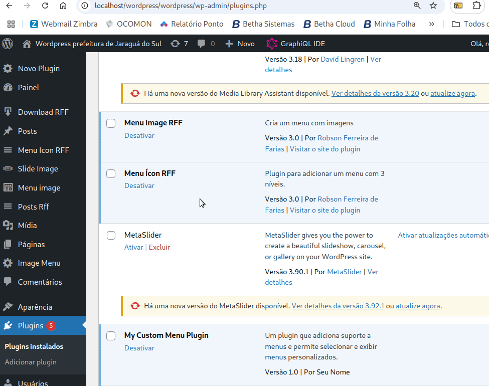
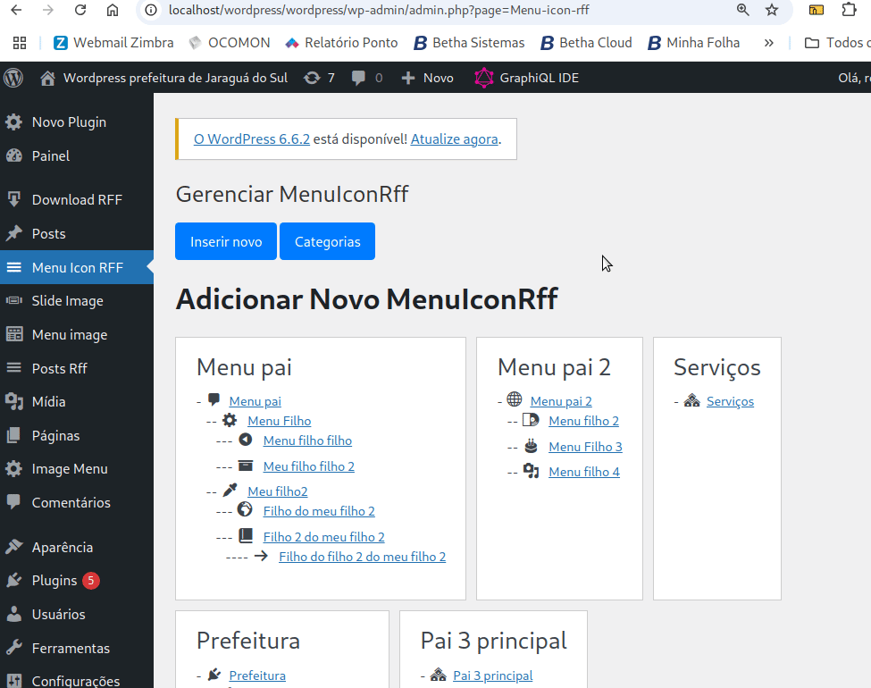
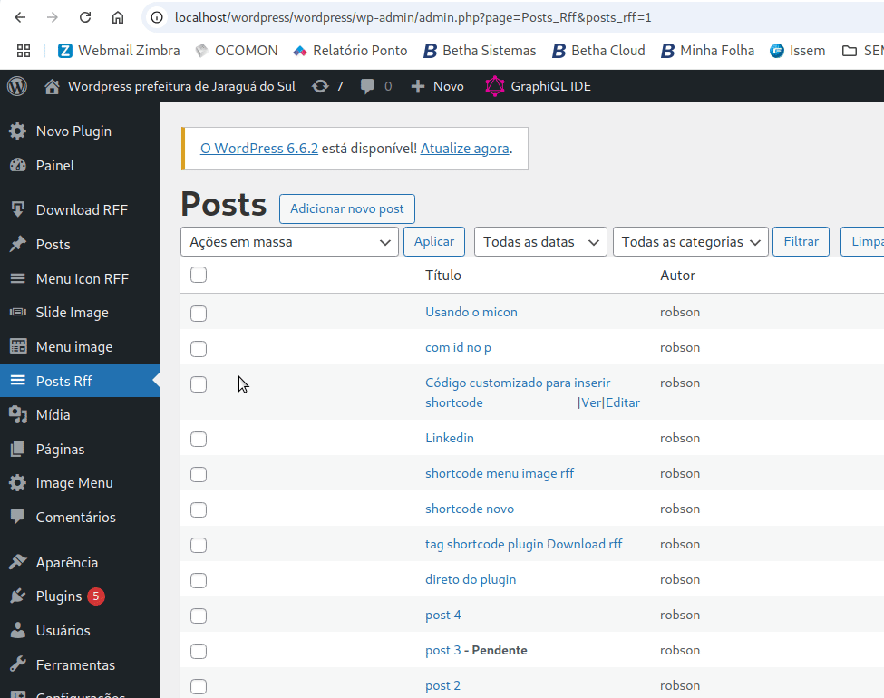

# Menu Icon RFF

## Instalação
> A Instalação é padrão do Wordpress. Logado na área administrativa, clique em: 
> **plugins**->**Adicionar plugin**->**Enviar plugin**->**Escolher arquivo**(Você já deve ter feito o download no meu github usando o link https://github.com/robsonfdfarias/menu_icon no formato zip)->**Instalar agora**, localize o **Menu Ícon RFF** e clique em ativar, ou, após o término do upload do plugin, clique no botão **Ativar plugin** que aparecerá.
>

## Criando um item Pai
>  Um item pai é o item que fica como principal, você pode inserir uma URL para ele, ou colocar um #. Veja como criar um item pai: 
>  

## Criando um item Filho
>  Um item filho é aquele que aparece quando passamos o mouse por cima do item pai. Para criar um item filho, siga os seguintes passos: 
>  

## Adicionando o menu a um post
>  Você pode usar o shortcode para adicionar o menu em um post, aqui vou usar o plugin que eu criei para criar posts usando o editor de texto web que eu criei, mas você pode usar também o plugin padrão do Wordpress. Para fazer isso, siga os seguintes passos: 
>  
> Segue a explicação do [micon_rff_1 idcat="1"]:
> - Os [] colchetes delimitam onde as referências ao shortcode devem ficar.
> - O micon_rff_1 faz referência ao modelo 1 do Menu Icon RFF
> - O idcat="1" está indicando que está sendo usado a categoria principal, que possui o ID 1. Se você mudar o número 1 por outro, certifique-se que exista uma categoria com esse ID. Veja a seguir como fazer isso. 

## Administrando as categorias
>  As categorias são administradas pelo próprio plugin. Para administrar as categorias, siga os seguintes passos: 
> 1. Visualizando as categorias:
>   
> 2. Criando uma categoria:
>   
> Obs.: No ponto 2 você consegue ver onde aparece o ID da categoria para usar no shortcode.
>   
> 3. Editando uma categoria:
>   
> 4. Excluindo uma categoria:
>   

<h2>☺Autor</h2>
<strong>Robson Ferreira de Farias</strong> 
<ul>
  <li>Github: <a href="https://github.com/robsonfdfarias">@robsonfdfarias</a></li>
  <li>Linkedin: <a href="https://www.linkedin.com/in/robson-farias-a8b01723a/">@robsonfdfarias</a></li>
  <li>Canais do Youtube: 
  </li>
    <ul>
      <li>@robsonfdfarias: <a href="https://www.youtube.com/@RobsonFarias-os2di">Robson Farias (< code >_)</></a></li>
      <li>@informaticacomrobsonfarias: <a href="https://www.youtube.com/c/Inform%C3%A1ticacomRobsonFarias">Canal do youtube</a></li>
    </ul>
</ul> 
